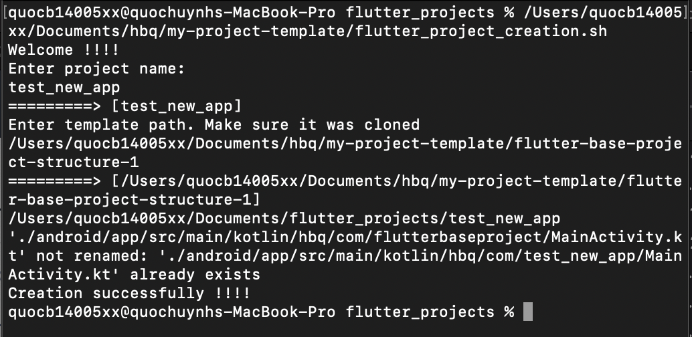
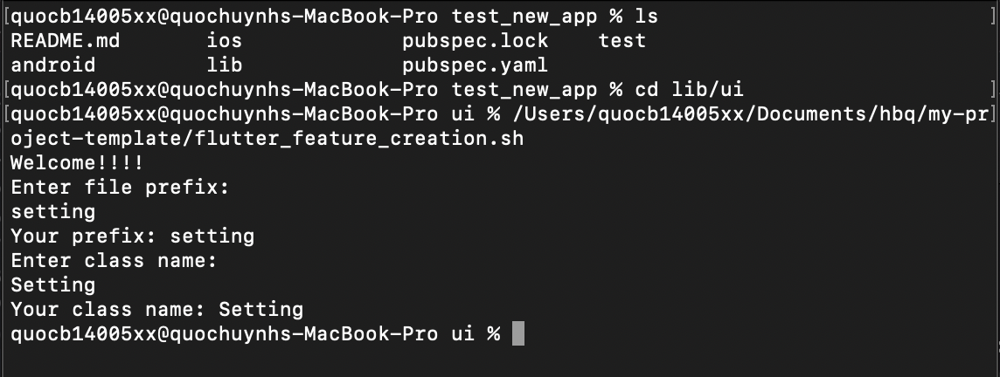
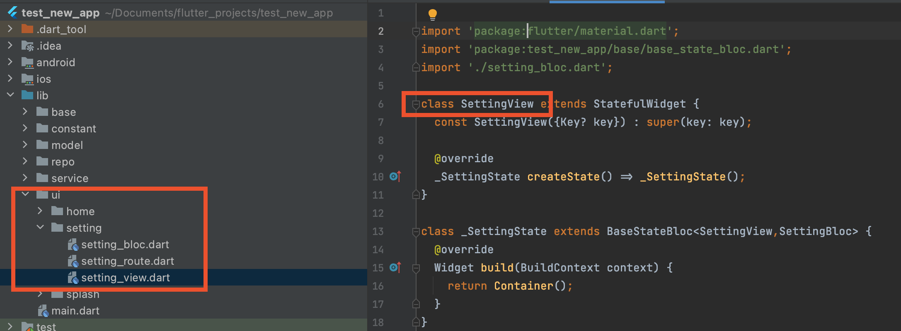

# my-project-template
These template help in fast project creation. This repo will include multiple template, choose the one which is suitable

## Features

- Create simple flutter project using rxdart, sqflite, provider
- Saparate project folder: view - bussiness logic - service
- Create feature file very fast: create 3 files (view, logic, route)

## Next release
- Add more app structure such as scope_model, flutter_bloc, redux, mobx...
- Update bashscript to use easily, switch another structure

## Dependencies

- [[sqflite]](https://pub.dev/packages/sqflite) - Dart wrapper on SQLite, a self-contained, high-reliability, embedded, SQL database engine.
- [[provider]](https://pub.dev/packages/provider) - A wrapper around InheritedWidget to make them easier to use and more reusable.
- [[rxdart]](https://pub.dev/packages/rxdart) - RxDart is an implementation of the popular reactiveX api for asynchronous programming, leveraging the native Dart Streams api.
- [[shared_preferences]](https://pub.dev/packages/shared_preferences) - Flutter plugin for reading and writing simple key-value pairs. Wraps NSUserDefaults on iOS and SharedPreferences on Android.

## Installation
Dart version required:
```dart
environment:
  sdk: ">=2.12.0 <3.0.0"
```


Clone the git sample.

```sh
git clone https://github.com/quochuynh67/my-project-template
```

## Usage
To create new project, by running:
```sh
../my-project-template/flutter_project_creation.sh
```

:arrow_right_hook: And then, Input your project name. For example: **test_new_project**

:arrow_right_hook: And then, Input the path to the template you want to use with new project. For example: **../my-project-template/flutter-base-project-structure-1**

:arrow_right_hook: After that, It will be created like the image below



:information_source: Note
 ``` 
Don't worry about `already exist MainActivity.kt` file, because Android studio was created one time.
And then bashscript change it's parent folder.
```

To create feature, by running:

:warning: make sure you went to **lib/ui** where contains your feature folder
```sh
../my-project-template/flutter_feature_creation.sh
```
:arrow_right_hook: And then, input the prefix file you want. For example **setting**:

This step will create 3 file: **setting_bloc.dart**, **setting_route.dart**, **setting_view.dart**

:arrow_right_hook: And then, input the name for class you want. For example: **Setting**:

This step will generate the content into the file such as: **SettingView**, **SettingBloc**.



